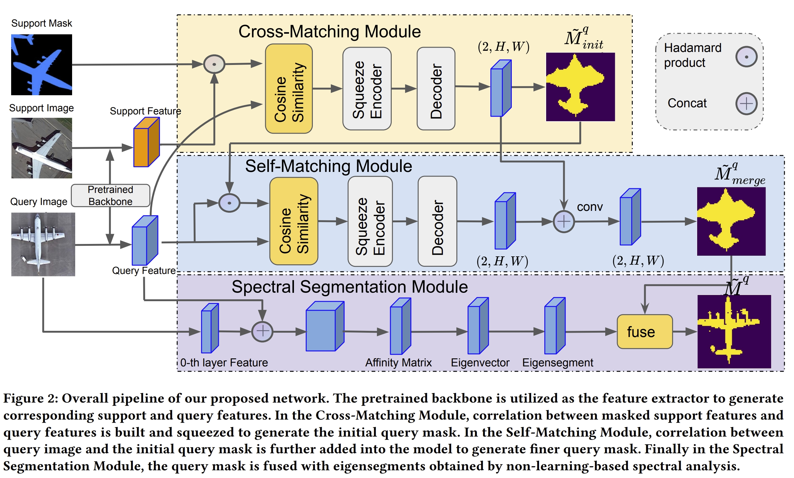

# Self-Correlation and Cross-Correlation Learning for Few-Shot Remote Sensing Image Semantic Segmentation


Introduction
------------
This is the source code for our paper [Self-Correlation and Cross-Correlation Learning for Few-Shot Remote Sensing Image Semantic Segmentation](http://arxiv.org/abs/2309.05840), which is accepted to Sigspatial 2023.

Network Architecture
------------


### Installation
* Install PyTorch 2.0.1 and other dependenies
* Clone this repo

```
git clone https://github.com/linhanwang/SCCNet.git
```

### Data Preparation

Download remote_sensing.tar.gz from [here](https://drive.google.com/drive/folders/1-URr9fX0v6_-Yo3B7St8UFNHiPWpXxnC?usp=sharing), unzip and put it under your directory 'SCCNet'.


### Train

```
python train.py  --max_steps 200000 --freeze True --datapath './remote_sensing/iSAID_patches' --img_size 256 --backbone resnet50 --fold 0 --benchmark isaid --lr 9e-4 --bsz 32 --logpath exp_name
```

The log and checkpoints are stored under directory 'logs'.

### Test

```
python test.py --datapath './remote_sensing/iSAID_patches' --img_size 256 --backbone resnet50 --fold 0 --benchmark isaid --bsz 64 --nshot 1 --load './logs/exp_name/best_model.pt'
```

We provide a pretrained-model for the above setting. You can download it from [here](https://drive.google.com/drive/folders/1IU3m_0qTgIzmz6mc_0J1b-dMGBZMnelg?usp=drive_link).

The fusion process is implemented in test.py, you can turn it on in test.sh. You can turn it on by setting fuse=True. The option eigen_path is used to indicate the directory of eigen vectors. The process to generate eigen vectors is described in [spectral](spectral/README.md).

### Citation

If you find SCCNet useful in your research or applications, please cite using this BibTeX:

```
@inproceedings{wang2023self,
  title={Self-Correlation and Cross-Correlation Learning for Few-Shot Remote Sensing Image Semantic Segmentation},
  author={Wang, Linhan and Lei, Shuo and He, Jianfeng and Wang, Shengkun and Zhang, Min and Lu, Chang-Tien},
  booktitle={Proceedings of the 31st ACM International Conference on Advances in Geographic Information Systems},
  pages={1--10},
  year={2023}
}
```

### Acknowledgements

We borrow code from public projects [SDM](https://github.com/caoql98/SDM), [HSNet](https://github.com/juhongm999/hsnet), [dss](https://github.com/lukemelas/deep-spectral-segmentation).
